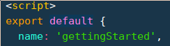
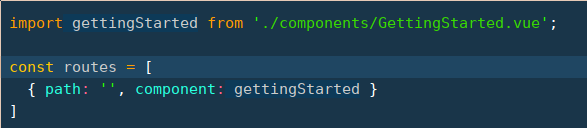

# importing components

- Create a .vue file describing a component. In the script tag of the component set a name property. This name property is used when dynamically loading components.  
  
- In src/routes.js import the component, then add the imported component to the routes-array.  
  
- All that is left to do is create an dropdown entry for the new component in /src/components/ui-components/dropdown.vue  
  
  The value has to match the name property given in the component.
